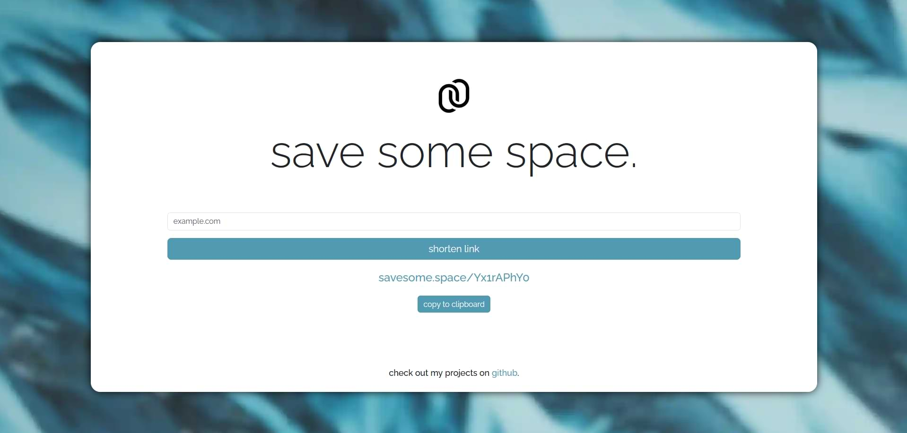

## save some space.

    

[](https://github.com/f4rys/Save-some-space/actions/workflows/node.js.yml) [](https://github.com/f4rys/Save-some-space/actions/workflows/codeql.yml)  

*save some space.* is a minimalist URL shortening service built with Express.js and MongoDB Atlas. Deployed via Firebase Web App Hosting. It provides a straightforward way to shorten long URLs into concise, random strings. Features include:

- Shortening: Instantly generate short, random URLs for easier sharing.
- Redirection: Seamlessly redirect users from shortened links to their original destinations.
- Scalable Storage: Utilizes MongoDB Atlas for reliable and scalable data storage in the cloud.
- Dynamic reloading: Implemented to prevent whole front-end from being reloaded on every change.

</br>



## Run locally

1. **Clone the Repository:**
   ```bash
   git clone https://github.com/f4rys/Save-some-space

2. **Add MongoDB Atlas credentials:**
  - Create .env file in the root directory
  - Add the following variables to the .env file:
    ```bash
    MONGODB={your-secret-from-mongodb-atlas}
    SERVER_SECRET={your-random-secret}
3. **Install dependencies and run:**
   ```bash
   npm install
   npm run start
4. **Open in browser:**
   ```bash
   http://localhost:5000/
   ```

## Credits
<div>• Background image by <a href="https://www.pexels.com/@harrison-candlin-1279336/">Harrison Candlin</a> on <a href="https://www.pexels.com/photo/close-up-photo-of-blue-background-2441454/">Pexels</a></div>
<div>• Logo by <a href="https://www.iconfinder.com/visualpharm">Ivan Boyko</a> on <a href="https://www.iconfinder.com/icons/309055/link_chain_connection_url_hyperlink_icon">Iconfinder</a></div>
