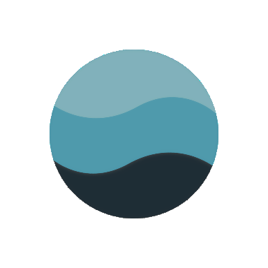
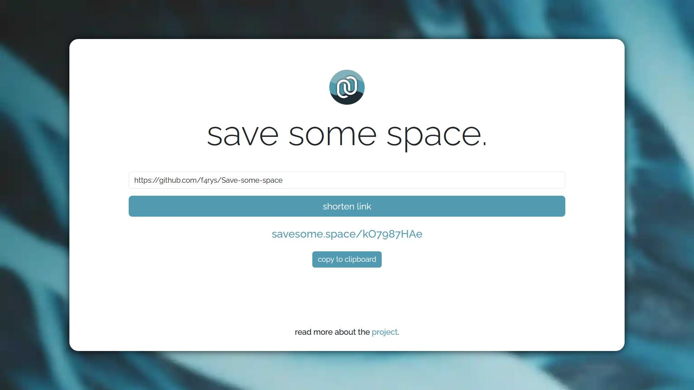

<div align="center" style="display: flex; justify-content: center; align-items: center; margin-bottom: 50px; margin-top: 40px">


</div>

<div align="center">
<h1>save some space.</h1>


[](https://github.com/f4rys/Save-some-space/actions/workflows/aws-deploy.yml)
[](https://github.com/f4rys/Save-some-space/actions/workflows/test-server.yml)
[](https://github.com/f4rys/Save-some-space/actions/workflows/test-client.yml)
[](https://github.com/f4rys/Save-some-space/actions/workflows/codeql.yml)
[](https://app.codacy.com/gh/f4rys/Save-some-space/dashboard?utm_source=gh&utm_medium=referral&utm_content=&utm_campaign=Badge_grade)


</div>

_save some space._ is a minimalist URL shortening service built with: Vite, React, Jest, Node.js, Express.js and MongoDB Atlas. Deployed to AWS EC2. It provides a straightforward way to shorten long URLs into concise, random strings. Features include:

- Shortening: Instantly generate short, random URLs for easier sharing.
- Redirection: Seamlessly redirect users from shortened links to their original destinations.
- Scalable Storage: Utilizes MongoDB Atlas for reliable and scalable data storage in the cloud.
- Dynamic reloading: Implemented to prevent whole front-end from being reloaded on every change.
- Privacy policy and terms of service: Implemented to ensure the privacy and user experience of the service is as intended.

</br>



## Run locally

1. **Clone the Repository:**

   ```bash
   git clone https://github.com/f4rys/Save-some-space
   ```

2. **Add MongoDB Atlas credentials:**

- Create .env file in the root directory
- Add the following variables to the .env file:
  ```bash
  MONGODB={your-secret-from-mongodb-atlas}
  SERVER_SECRET={your-random-secret}
  VITE_API_URL=http://localhost:8080
  ```

3. **Install dependencies for the server and run:**

   ```bash
   cd server
   npm install
   npm run dev
   ```

4. **Install dependencies for the client and run:**

   Open another terminal and run these commands:

   ```bash
   cd client
   npm install
   npm run dev
   ```

5. **Open in browser:**
   ```bash
   http://localhost:5173/
   ```

## Credits

<div>• Background image by <a href="https://www.pexels.com/@harrison-candlin-1279336/">Harrison Candlin</a> on <a href="https://www.pexels.com/photo/close-up-photo-of-blue-background-2441454/">Pexels</a></div>
<div>• Logo by <a href="https://www.iconfinder.com/visualpharm">Ivan Boyko</a> on <a href="https://www.iconfinder.com/icons/309055/link_chain_connection_url_hyperlink_icon">Iconfinder</a></div>
